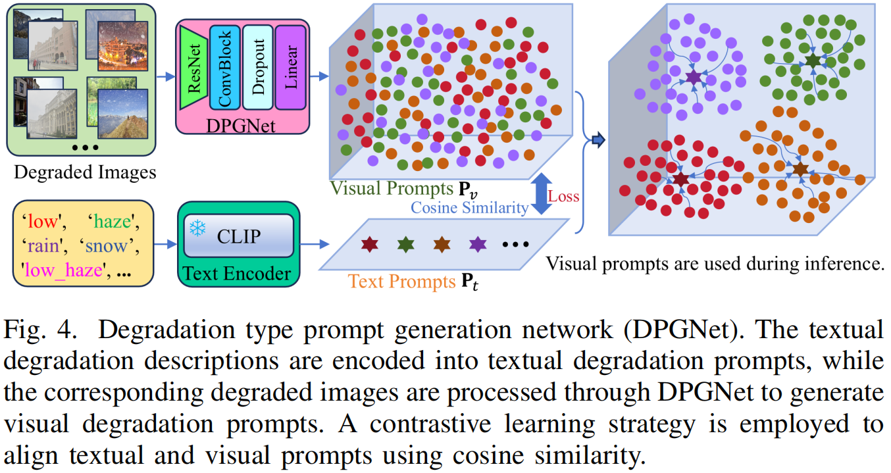
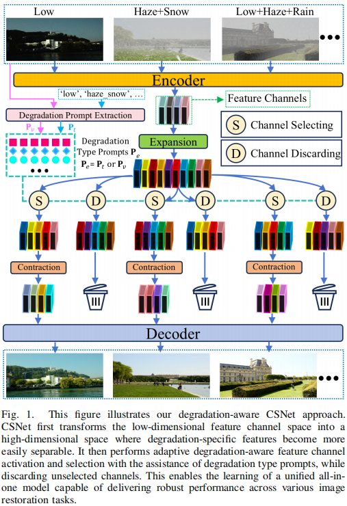

# CSNet: All-in-One Image Restoration via Adaptive Degradation-Aware Feature Channel Activation and Selection

## Abstract

The goal of all-in-one image restoration is to address multiple types of image degradations using a single model. Owing to the divergence among degradation characteristics, directly applying models designed for specific restoration tasks to the all-in-one scenario often leads to performance degradation. Therefore, incorporating prior knowledge of degradations has become a key strategy for enhancing performance. Existing approaches include implicit prompts (e.g., PromptIR), learnable dynamic prompts (e.g., DPPD), textual prompts (e.g., InstructIR), frequency-domain discrepancies (e.g., AdaIR), and features derived from large pre-trained models (e.g., Perceive-IR). Although these methods have demonstrated promising results, they still suffer from the following limitations:

  **► Limitation-1**: Implicit prompts or learning-based dynamic prompts exhibit limited accuracy in identifying degradation types, particularly when dealing with diverse and composite degradations. This constraint in precise recognition and modeling significantly hinders further improvements in model performance.

  **► Limitation-2**: In frequency-based degradation identification methods such as AdaIR, the discriminative accuracy for degradation types tends to decline as the number of target degradations increases or when composite degradations are encountered, ultimately limiting overall restoration performance. On the other hand, some approaches leverage intermediate features from pre-trained models to guide the restoration process. However, since these pre-trained models are typically not trained on degraded images, feeding corrupted images into such models results in feature representations that retain substantial degradation artifacts, which adversely affects the restoration outcome. Therefore, achieving accurate degradation type identification remains a critical challenge in advancing all-in-one image restoration methods.

  **► Limitation-3**: Current approaches to prompt and image feature fusion primarily rely on channel attention mechanisms (e.g., InstructIR) or cross-attention mechanisms (e.g., NDR). These methods aim to fully incorporate all feature information to enhance the model’s representational and learning capacity, demonstrating strong performance in specific image restoration tasks. However, in all-in-one image restoration scenarios, such strategies may become suboptimal, as they often overlook the mutual interference among feature channels corresponding to different degradation types. To alleviate this issue, SmartAttempts to introduce a gating mechanism that filters feature channels in a soft-routing manner, thereby mitigating negative interactions between multiple degradations. Nevertheless, this approach may still not be the optimal solution for suppressing inter-channel interference, as it retains certain features from all channels, making it difficult to effectively reduce cross-degradation feature coupling.

To address the aforementioned challenges, this paper proposes a novel adaptive degradation-aware feature channel activation and selection framework, termed CSNet. The framework incorporates an explicit degradation prompting mechanism that adaptively identifies degradation types from the input degraded images and provides guidance for all-in-one image restoration. To further mitigate mutual interference among features of multiple degradations, we introduce an innovative degradation-aware channel activation and selection strategy. This strategy effectively suppresses coupling effects between different degradations at the feature channel level, thereby significantly enhancing restoration performance.

  **For Limitation-1**: To overcome the limitations of implicit prompts in accurately identifying degradation types, we propose an explicit degradation prompt strategy. Inspired by InstructIR, which demonstrates the potential of textual prompts in image restoration tasks, our method incorporates semantically explicit textual guidance, as illustrated in the lower part of Fig. 4. By introducing such explicit prompts, our framework achieves more precise recognition of degradation types and effectively alleviates the representational limitations of implicit or dynamically learned prompts in complex degradation scenarios.

  **For Limitation-2**: To address the limitations of relying solely on frequency-domain differences for identifying degradation types—particularly under mixed degradations—and to mitigate the issue of residual degradation features introduced by pre-trained models when encoding degraded images, this paper proposes a contrastive learning-based strategy for degradation type recognition, as depicted in Fig. 4. The method utilizes only the text encoder from a pre-trained model, coupled with a lightweight image encoder, to achieve automatic degradation identification through contrastive learning. This framework enables the extraction of purer degradation-related representations directly from degraded images, significantly improving adaptability to complex and mixed degradation scenarios.

  **For Limitation-3**: To mitigate the interference among multiple degradations in existing prompt and image feature fusion methods, we propose a novel degradation-aware adaptive channel activation and selection strategy, as illustrated in Fig. 2. This strategy performs adaptive channel filtering in a high-dimensional feature space: only the feature channels most sensitive to the current degradation type are retained for subsequent decoding and reconstruction, while the unselected channels are directly discarded. Unlike conventional channel attention or gating mechanisms, our approach does not apply soft weighting or selection to all channels; instead, it employs a hard selection mechanism to significantly reduce feature-level interference across different degradations. As a result, the proposed method effectively enhances the restoration performance of the model in complex degradation scenarios.

  

To address the issue of inter-channel interference among features from multiple degradations, we conducted a systematic manual analysis of task-specific channels in an all-in-one restoration scenario, as summarized in Table I. In this experiment, textual prompts were manually designed to identify dedicated channels for each degradation type. The results indicate that each task achieves peak performance when assigned its most relevant channels, whereas a misallocation of channels from other tasks leads to significant performance degradation. For instance, channels specialized for denoising perform optimally on denoising tasks but exhibit markedly inferior results when applied to deraining or dehazing. It is worth noting that even when all channels are used for denoising, the performance (31.18 dB / 0.885 SSIM) remains lower than that achieved using task-specific channels. This observation suggests that feature channels relied upon by different tasks are not entirely independent; instead, they exhibit certain correlations and interference. Reusing channels across tasks can considerably hinder further improvements in model performance. Therefore, adaptively assigning suitable dedicated channels for each degradation type in all-in-one restoration can effectively suppress inter-task interference and significantly enhance overall restoration quality.

