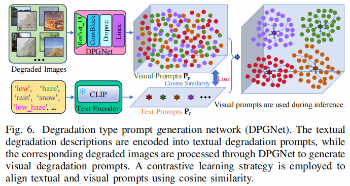
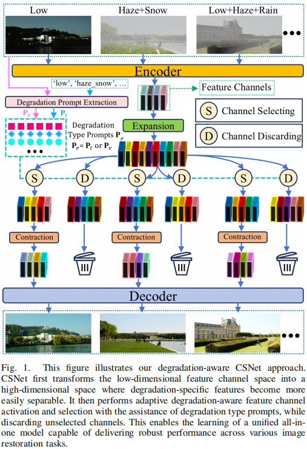
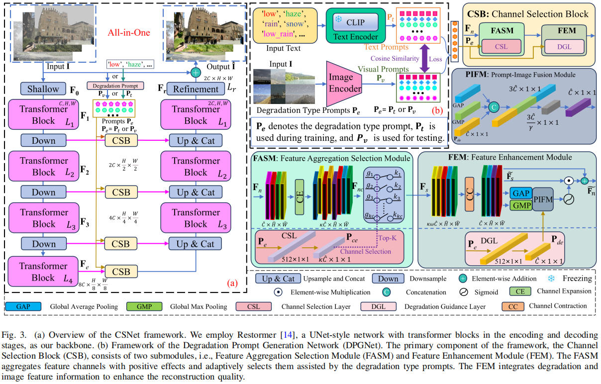
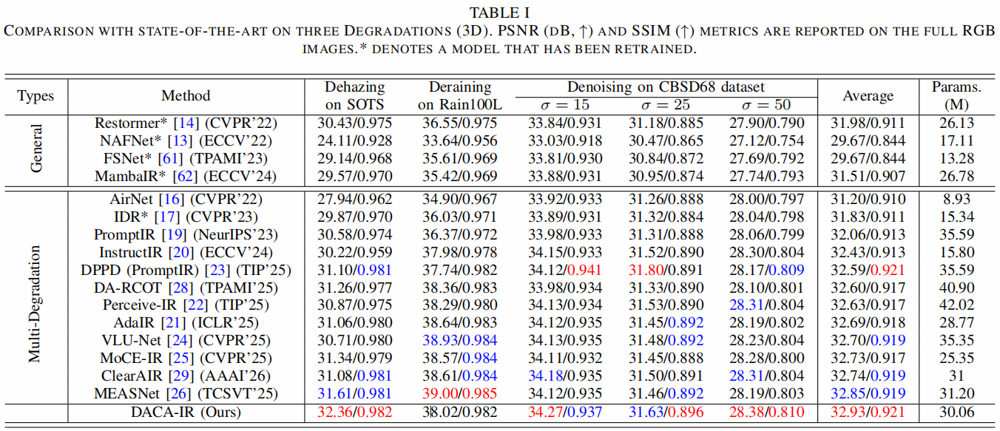
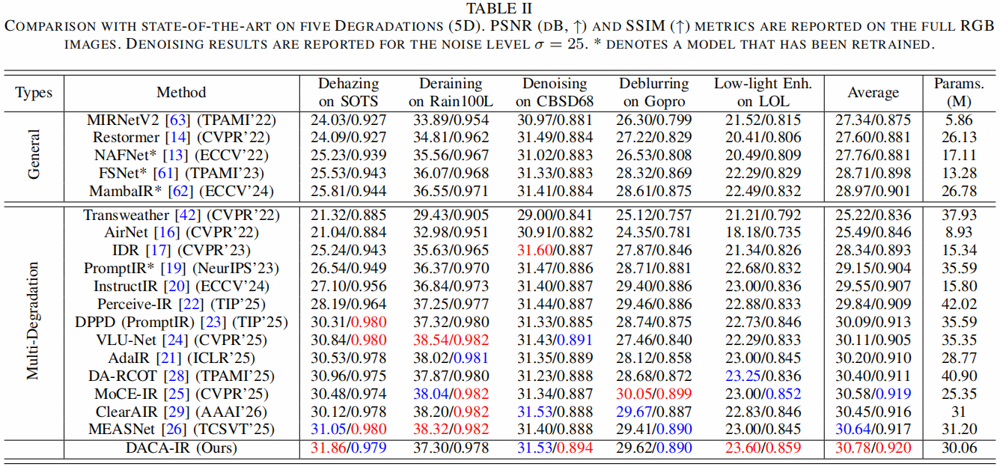
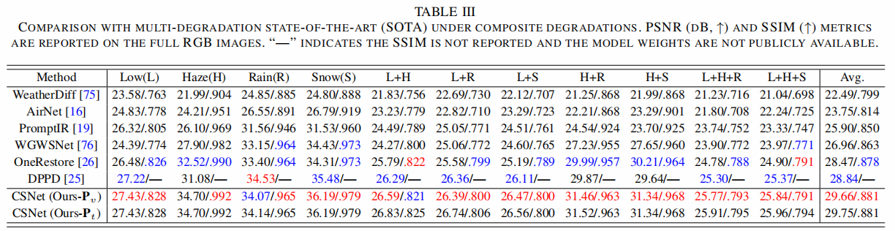
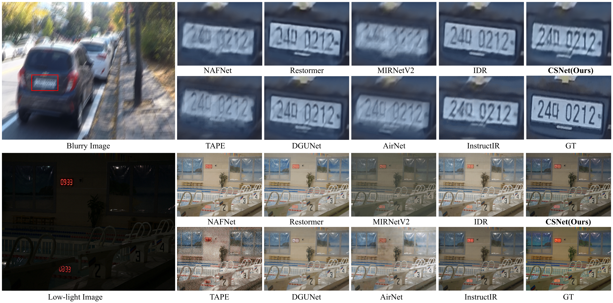
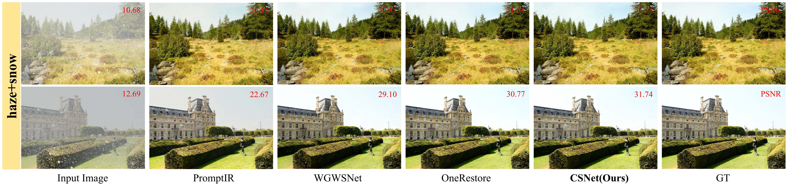
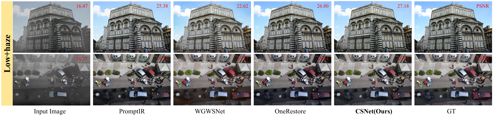

# Adaptive Degradation-Aware Channel Selection for Multi-Degradation Image Restoration

## Abstract

The goal of multi-degradation (also referred to as multi-task or all-in-one) image restoration is to address multiple types of image degradations using a single model. Owing to the divergence among degradation characteristics, directly applying models designed for specific restoration tasks to the multi-degradation scenario often leads to performance degradation. Therefore, incorporating prior knowledge of degradations has become a key strategy for enhancing performance. Existing approaches include implicit prompts (e.g., PromptIR), learnable dynamic prompts (e.g., DPPD), textual prompts (e.g., InstructIR), frequency-domain discrepancies (e.g., AdaIR), and features derived from large pre-trained models (e.g., Perceive-IR). Although these methods have demonstrated promising results, they still suffer from the following limitations:

  **► Limitation-1**: Existing methods mainly operate at the prompt, task, or expert level, while overlooking fine-grained channel-level characteristics of image features. Consequently, degradation-specific responses are insufficiently disentangled, leading to redundant and entangled feature representations.
  
  **► Limitation-2**: Most existing guidance mechanisms rely on soft modulation strategies, such as attention-based reweighting or prompt conditioning. Although these methods can alleviate degradation interference to some extent, they do not explicitly model channel-wise suppression, leaving residual cross-degradation interference in the learned representations.
  
  **► Limitation-3**: Existing studies primarily utilize guidance features for degradation discrimination, prompt conditioning, or expert routing. However, the intrinsic role of degradation-aware guidance in shaping feature representations has not been thoroughly explored. In particular, it remains unclear how degradation cues can be leveraged to selectively activate informative channels and facilitate more effective restoration.
  

To address the aforementioned challenges, we propose a novel Degradation-Aware Channel Activation framework, termed DACA-IR, for multi-degradation image restoration. The framework incorporates an explicit degradation-aware prompting mechanism that extracts degradation-related cues from degraded images and provides adaptive guidance for restoration. Furthermore, we introduce a degradation-aware channel activation strategy that dynamically activates informative channels while suppressing degradation-irrelevant responses into a silent state. By explicitly regulating channel-wise activation patterns, the proposed framework effectively alleviates feature entanglement across different degradations and promotes more discriminative feature representations, leading to improved restoration performance.

  **For Limitation-1**: To overcome the limitations of implicit prompts in accurately identifying degradation types, we propose an explicit degradation prompt strategy. Inspired by InstructIR, which demonstrates the potential of textual prompts in image restoration tasks, our method incorporates semantically explicit textual guidance, as illustrated in the lower part of Fig. 6. By introducing such explicit prompts, our framework achieves more precise recognition of degradation types and effectively alleviates the representational limitations of implicit or dynamically learned prompts in complex degradation scenarios.

  **For Limitation-2**: To address the limitations of relying solely on frequency-domain differences for identifying degradation types—particularly under mixed degradations—and to mitigate the issue of residual degradation features introduced by pre-trained models when encoding degraded images, this paper proposes a contrastive learning-based strategy for degradation type recognition, as depicted in Fig. 6. The method utilizes only the text encoder from a pre-trained model, coupled with a lightweight image encoder, to achieve automatic degradation identification through contrastive learning. This framework enables the extraction of purer degradation-related representations directly from degraded images, significantly improving adaptability to complex and mixed degradation scenarios.

  

  **For Limitation-3**: To mitigate the interference among multiple degradations in existing prompt and image feature fusion methods, we propose a novel degradation-aware adaptive channel activation and selection strategy, as illustrated in Fig. 1. This strategy performs adaptive channel filtering in a high-dimensional feature space: only the feature channels most sensitive to the current degradation type are retained for subsequent decoding and reconstruction, while the unselected channels are directly discarded. Unlike conventional channel attention or gating mechanisms, our approach does not apply soft weighting or selection to all channels; instead, it employs a hard selection mechanism to significantly reduce feature-level interference across different degradations. As a result, the proposed method effectively enhances the restoration performance of the model in complex degradation scenarios.

  

To address the issue of inter-channel interference among features from multiple degradations, we conducted a systematic manual analysis of task-specific channels in an multi-degradation restoration scenario, as summarized in Table I. In this experiment, textual prompts were manually designed to identify dedicated channels for each degradation type. The results indicate that each task achieves peak performance when assigned its most relevant channels, whereas a misallocation of channels from other tasks leads to significant performance degradation. For instance, channels specialized for denoising perform optimally on denoising tasks but exhibit markedly inferior results when applied to deraining or dehazing. It is worth noting that even when all channels are used for denoising, the performance (31.28 dB / 0.887 SSIM) remains lower than that achieved using task-specific channels. This observation suggests that feature channels relied upon by different tasks are not entirely independent; instead, they exhibit certain correlations and interference. Reusing channels across tasks can considerably hinder further improvements in model performance. Therefore, adaptively assigning suitable dedicated channels for each degradation type in multi-degradation restoration can effectively suppress inter-task interference and significantly enhance overall restoration quality.

  

Finally, we propose a novel multi-degradation image restoration framework, termed Degradation-Aware Feature Channel Activation and Selection Network (CSNet), as depicted in Fig. 3. The framework extracts explicit degradation prompts from the input degraded image to guide the restoration process. A Channel Selection Block (CSB) is inserted between the encoder and decoder to adaptively select the most task-relevant feature channels for decoding. Furthermore, to strengthen the decoding capability under diverse degradation patterns, a Feature Enhancement Module (FEM) is introduced in the decoder, thereby significantly improving restoration performance.

  

<b>Quantitative Comparison with SOTA (click to expand)</b>

 

  

  

  

<b>Additional Visual Comparison Results (click to expand)</b>

 

  

  

  

  

  

  

  

  

  

